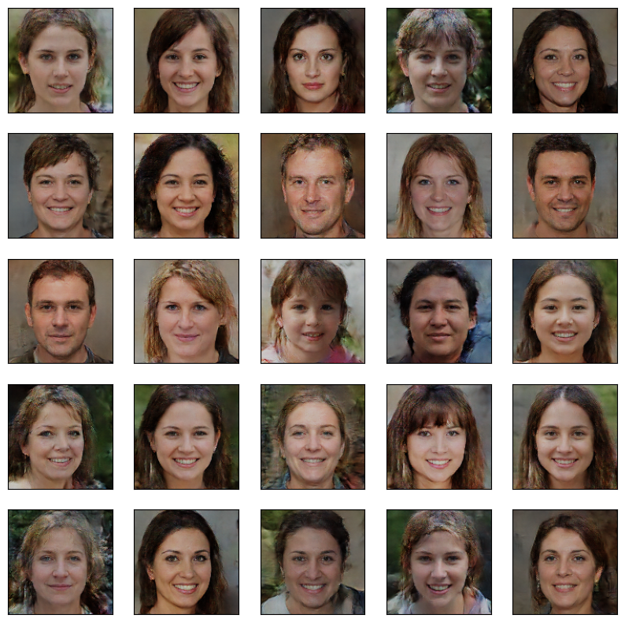

# FaceForgeGAN 🎭

A Deep Convolutional Generative Adversarial Network (DCGAN) built with Keras/TensorFlow that generates realistic 128x128 human faces from pure noise. Trained from scratch, this model is capable of producing high-quality synthetic portraits using a combination of convolutional layers, batch normalization, and LeakyReLU activations.

## 🧠 Model Overview

### Generator Architecture
- Starts from a dense layer reshaped to (128, 128, 3)
- Multiple Conv2D and Conv2DTranspose layers to upscale features
- LeakyReLU + BatchNorm for stable training
- Output layer with `tanh` activation to generate RGB images

**Total Parameters**: 21.2M  
**Output Size**: 128x128 RGB images

### Discriminator Architecture
- Deep convolutional layers with increasing filters
- LeakyReLU activations
- Binary classification (real/fake)

**Total Parameters**: 3.9M

## 📸 Sample Outputs

Generated after **250 iterations**:



## 🛠️ Setup

```bash
git clone https://github.com/yourusername/FaceForgeGAN.git
cd FaceForgeGAN
pip install -r requirements.txt
